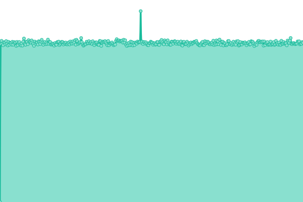
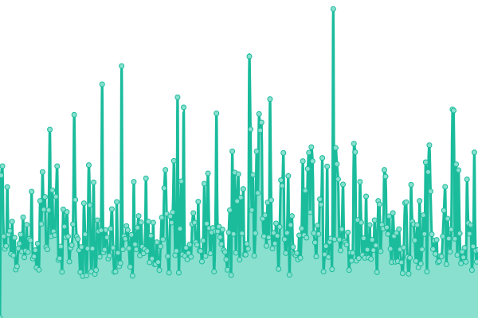

# [📈 Live Status](https://upptime.github.io/upptime): <!--live status--> **🟧 Partial outage**

This repository contains the open-source uptime monitor and status page for [Upptime](https://upptime.js.org), powered by [Upptime](https://github.com/upptime/upptime).

With [Upptime](https://upptime.js.org), you can get your own unlimited and free uptime monitor and status page, powered entirely by a GitHub repository. We use [Issues](https://github.com/upptime/upptime/issues) as incident reports, [Actions](https://github.com/201508876PMH/upptime/actions) as uptime monitors, and [Pages](https://upptime.github.io/upptime) for the status page.

<!--start: status pages-->
<!-- This summary is generated by Upptime (https://github.com/upptime/upptime) -->
<!-- Do not edit this manually, your changes will be overwritten -->
<!-- prettier-ignore -->
| URL | Status | History | Response Time | Uptime |
| --- | ------ | ------- | ------------- | ------ |
|  [Tower](https://pmh-unraid.dk) | 🟥 Down | [tower.yml](https://github.com/201508876PMH/upptime/commits/HEAD/history/tower.yml) | 

 0ms
     
 | 

<a href="https://201508876PMH.github.io/upptime/history/tower">0.01%</a>
    

|  [Tower-bot](https://ap-bot.pmh-unraid.dk) | 🟥 Down | [tower-bot.yml](https://github.com/201508876PMH/upptime/commits/HEAD/history/tower-bot.yml) | 

 0ms
     
 | 

<a href="https://201508876PMH.github.io/upptime/history/tower-bot">0.01%</a>
    

|  [Dozzle](https://dozzle.pmh-unraid.dk) | 🟩 Up | [dozzle.yml](https://github.com/201508876PMH/upptime/commits/HEAD/history/dozzle.yml) | 

 583ms
     
 | 

<a href="https://201508876PMH.github.io/upptime/history/dozzle">69.98%</a>
    

|  [Google](https://google.dk) | 🟩 Up | [google.yml](https://github.com/201508876PMH/upptime/commits/HEAD/history/google.yml) | 

 149ms
     
 | 

<a href="https://201508876PMH.github.io/upptime/history/google">100.00%</a>
    

<!--end: status pages-->

[**Visit our status website →**](https://upptime.github.io/upptime)

## 📄 License

- Powered by: [Upptime](https://github.com/upptime/upptime)
- Code: [MIT](./LICENSE) © [Upptime](https://upptime.js.org)
- Data in the `./history` directory: [Open Database License](https://opendatacommons.org/licenses/odbl/1-0/)
